# Receipts

Proof-of-Execution Hiring Agent for the Qwen Cloud Global AI Hackathon.

**Track:** Track 4 — Autopilot Agent  
**Status:** Planning and architecture package. Implementation scaffold is the next phase.  
**Deadline:** July 9, 2026 at 5:00pm EDT / 2:00pm PDT

Receipts verifies candidate claims against concrete work artifacts. Instead of ranking a resume by keywords, it uses Qwen Cloud to plan verification steps, extracts structured claims, calls deterministic tools, checks GitHub authorship and repository originality, executes one supported repository in a sandbox, links claims to evidence, produces a rubric-backed recommendation, and keeps a human reviewer in control.

## Hackathon Fit

Track 4 asks for an autopilot agent that can manage ambiguous real-world workflows with external tools and human checkpoints. Receipts maps directly to that pattern:

- Ambiguous input: resumes, GitHub links, demos, writeups, and job rubrics.
- Agent planning: Qwen decides which evidence to request and how to assemble the profile.
- External tools: GitHub metadata, authorship/originality analysis, sandbox execution, web fetch, scheduling.
- Human checkpoint: hiring user reviews the profile and confirms or overrides the recommendation.
- Production readiness: persisted trace, audit log, security boundaries, and Alibaba Cloud deployment proof.

## MVP Demo

The hackathon demo is one reliable golden path:

1. Configure one job, weighted rubric, and interview slots.
2. Submit a known-good candidate fixture with resume text and a supported GitHub repository.
3. Run the Qwen-powered agent.
4. Extract at least three claims.
5. Harvest GitHub evidence.
6. Produce authorship and originality results.
7. Execute the repository in a constrained sandbox.
8. Mark claims as `VERIFIED`, `PARTIALLY_SUPPORTED`, `UNSUPPORTED`, or `CONTRADICTED`.
9. Score the candidate against the rubric.
10. Show the credibility profile, trace, decision, human review, audit log, and scheduling link.
11. Book one interview slot.
12. Show Alibaba Cloud deployment proof.

## Tech Stack

| Layer | Choice | Why |
|---|---|---|
| Agent model provider | Qwen Cloud through OpenAI-compatible API | Required by the hackathon; supports structured outputs and model routing. |
| Agent framework | Spring AI `ChatClient` with tool calling | Fits Java/Spring backend and typed tool boundaries. |
| Backend | Java 21, Spring Boot | Strong API, persistence, scheduling, and deployment support. |
| Frontend | Next.js, React, Tailwind CSS, shadcn/ui | Fast dashboard delivery with reliable component primitives. |
| Database | ApsaraDB RDS PostgreSQL preferred; Postgres on ECS acceptable for demo | System of record for jobs, candidates, claims, evidence, traces, decisions, interviews, and audit events. |
| Object storage | Alibaba Cloud OSS | Hackathon-aligned object storage for resumes, sandbox logs, generated artifacts, and cached fixture runs. |
| Sandbox host | Docker on Alibaba Cloud ECS | Gives direct control over untrusted-code execution and resource limits. |
| Email | Alibaba DirectMail | Optional; dashboard-visible scheduling links remain the demo fallback. |
| Deployment | Alibaba Cloud ECS, OSS, and either ApsaraDB RDS PostgreSQL or Postgres on ECS | Keeps the demo aligned with the submission requirement. |

Model names are environment configuration, not hard-coded:

```text
QWEN_BASE_URL
QWEN_API_KEY
QWEN_PLANNER_MODEL
QWEN_EXTRACTOR_MODEL
```

## Core Workflow

```mermaid
flowchart LR
    JOB["Job + Rubric"] --> CAND["Candidate Submission"]
    CAND --> CLAIMS["Qwen Claim Extraction"]
    CLAIMS --> GH["GitHub Evidence Harvest"]
    GH --> AUTH["Authorship + Originality"]
    AUTH --> SBX["Sandbox Proof"]
    SBX --> VERIFY["Deterministic Claim Verification"]
    VERIFY --> PROFILE["Credibility Profile"]
    PROFILE --> SCORE["Qwen Rubric Scoring"]
    SCORE --> REVIEW["Human Review / Override"]
    REVIEW --> SCHED["Scheduling Link"]
    SCHED --> AUDIT["Audit Log"]
```



The invariant is simple: Qwen can propose, summarize, and reason, but deterministic tools decide whether a claim has enough evidence to be marked verified.

## Repository Map

```text
README.md
prd.md
architecture.md
LICENSE
docs/
  deployment.md
  demo-script.md
  fixtures.md
```

## Submission Checklist

- Public source repository.
- MIT license.
- README with project overview, setup path, tech stack, workflow, and submission status.
- Product requirements document.
- Architecture overview with diagrams.
- Demo fixtures or fixture instructions.
- Public demo video, targeting under three minutes.
- Alibaba Cloud deployment proof.
- Clear Qwen Cloud usage description.
- Track identification: Track 4 — Autopilot Agent.
