# Architecture Overview

**Project:** Receipts — Proof-of-Execution Hiring Agent  
**Hackathon:** Qwen Cloud Global AI Hackathon  
**Track:** Track 4 — Autopilot Agent

---

## 1. Overview

Receipts is an evidence-first autonomous hiring verification system. It evaluates candidate claims by harvesting work artifacts, verifying authorship and originality, executing selected code in an isolated sandbox, linking claims to deterministic evidence, scoring fit against a job rubric, and supporting interview scheduling with human review and auditability.

The system is built around one core invariant:

> A claim is not marked as verified because a model says so. A claim is marked as verified only when deterministic code confirms that a concrete evidence pointer exists and supports the claim.

The architecture separates the system into two major layers:

1. **Agent and Verification Engine** — the reasoning and verification core.
2. **Platform and Experience** — the API, persistence, dashboard, scheduling, audit, and deployment layer.

These layers communicate through stable contracts: data model, REST/SSE API shapes, tool interfaces, and the `AgentRun` lifecycle.

---

## 2. Architectural Goals

- Support an end-to-end agentic workflow for candidate verification.
- Use Qwen Cloud models for planning, extraction, classification, scoring, and structured outputs.
- Use deterministic verification code to validate model-proposed evidence.
- Keep all decisions evidence-linked, explainable, reviewable, and audit-logged.
- Execute untrusted candidate code only inside a constrained sandbox.
- Provide a demoable hiring dashboard with candidate profile, trace, decision, override, audit, and scheduling.
- Deploy backend and supporting services on Alibaba Cloud infrastructure.
- Keep the hackathon implementation narrow, reliable, and reproducible.

---

## 3. Key Architecture Decisions

| Area | Decision |
|---|---|
| Backend runtime | Java 21 |
| Backend framework | Spring Boot |
| Agent framework | Spring AI with `ChatClient`, tool calling, structured outputs, and optional MCP client support |
| LLM provider | Qwen Cloud through OpenAI-compatible endpoint |
| Planner / judgment model | Larger Qwen model for planning, decisioning, and rubric scoring |
| Extraction / classification model | Faster Qwen model for claim extraction and high-volume subtasks |
| Frontend | Next.js, React, Tailwind CSS, shadcn/ui |
| Database | PostgreSQL, optionally with pgvector |
| Object storage | Alibaba Cloud OSS |
| Sandbox | Docker on Alibaba Cloud ECS |
| Deployment target | Alibaba Cloud, preferably `ap-southeast-1` |
| Scheduling | Magic-link self-scheduling, dashboard-visible for demo reliability |
| Trace transport | SSE preferred; polling fallback |
| Concurrency | Virtual-thread or equivalent I/O fan-out with separate bounded sandbox executor |
| Verification principle | LLM proposes; deterministic code verifies |

---

## 4. High-Level System Architecture

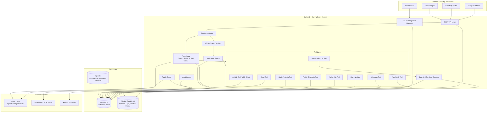

---

## 5. Component Responsibilities

### 5.1 Frontend

The frontend provides the hiring control plane.

Responsibilities:

- Job posting and rubric configuration.
- Interview slot configuration.
- Candidate submission review.
- Candidate pipeline view.
- Agent run status display.
- Evidence-linked credibility profile.
- Tool-call and reasoning trace viewer.
- Human override controls.
- Audit log display.
- Dashboard-visible scheduling links.
- Candidate magic-link scheduling page.

---

### 5.2 API Layer

The API layer exposes REST endpoints for platform operations and trace endpoints for live or near-live updates.

Responsibilities:

- Validate requests.
- Persist jobs, rubrics, candidates, artifacts, slots, decisions, and overrides.
- Trigger `AgentRun` creation.
- Expose candidate profiles and decisions.
- Expose audit events.
- Expose scheduling endpoints.
- Stream or poll agent progress.

---

### 5.3 Run Orchestrator

The run orchestrator manages the lifecycle of candidate verification.

Responsibilities:

- Queue and start `AgentRun` instances.
- Prevent duplicate inconsistent runs.
- Resume runs from persisted state where feasible.
- Coordinate agent steps and tool calls.
- Fan out I/O-bound verification tasks.
- Route sandbox work to a separate bounded executor.
- Persist run state transitions.
- Classify failures as retryable or terminal.

---

### 5.4 Agent Loop

The agent loop is responsible for planning, tool selection, claim extraction, evidence interpretation, and decision composition.

Responsibilities:

- Extract structured claims from resume text and candidate submissions.
- Plan evidence-harvesting steps.
- Invoke tools through typed interfaces.
- Propose evidence pointers for claims.
- Assemble credibility profiles.
- Score against job rubric.
- Emit structured decision outputs.
- Persist model turns and tool calls.
- Avoid fabricating unsupported conclusions.

The agent does not directly mark a claim as verified. Verification state is assigned only after deterministic evidence validation.

---

### 5.5 Verification Engine

The verification engine performs deterministic and semi-deterministic checks over candidate artifacts.

Responsibilities:

- Authorship analysis.
- Fork and originality detection.
- Commit-cadence heuristics.
- Sandbox proof-of-execution.
- Static analysis for supported ecosystems.
- Claim-to-evidence validation.
- Confidence assignment.
- Verification result persistence.

---

### 5.6 Tool Layer

Tools are typed capabilities callable by the agent or verification engine.

Required tools:

| Tool | Responsibility |
|---|---|
| GitHub Tool | Fetch repository metadata, commits, contributors, forks, languages, file tree, PRs, and issues where available. |
| Authorship Tool | Calculate candidate contribution signals using GitHub-account-tied data where possible. |
| Originality Tool | Detect forks and estimate candidate-original contribution. |
| Sandbox Runner Tool | Clone, prepare, build, test, or smoke-test supported repositories in isolation. |
| Claim Verifier | Validate whether proposed evidence pointers exist and support claims. |
| Rubric Scorer | Score verified profile against job rubric. |
| Scheduler Tool | Generate magic links and book slots atomically. |
| Web Fetch Tool | Fetch demo pages and writeups. |
| Static Analysis Tool | Produce basic code structure and complexity signals for supported ecosystems. |
| Email Tool | Send scheduling links and confirmations. |

---

### 5.7 Data Layer

PostgreSQL is the system of record.

Responsibilities:

- Store jobs, rubrics, candidates, artifacts, claims, evidence, verification results, profiles, decisions, interviews, agent runs, tool calls, and audit events.
- Support idempotent run recovery.
- Store trace data for dashboard display.
- Optionally support pgvector-based semantic retrieval for claim/evidence matching.

Alibaba Cloud OSS stores large or raw artifacts:

- Resume files.
- Sandbox logs.
- Build output.
- Test output.
- Static-analysis artifacts.
- Cached demo artifacts.

---

## 6. Agent Run Lifecycle

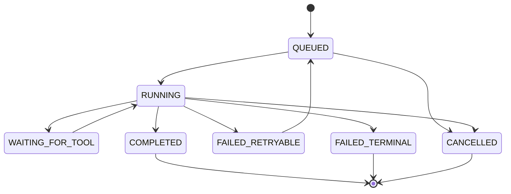

Supported `AgentRun` states:

```text
QUEUED
RUNNING
WAITING_FOR_TOOL
COMPLETED
FAILED_RETRYABLE
FAILED_TERMINAL
CANCELLED
```

---

## 7. Agent Orchestration Flow

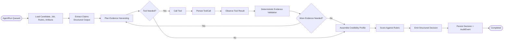

---

## 8. Claim Verification Flow

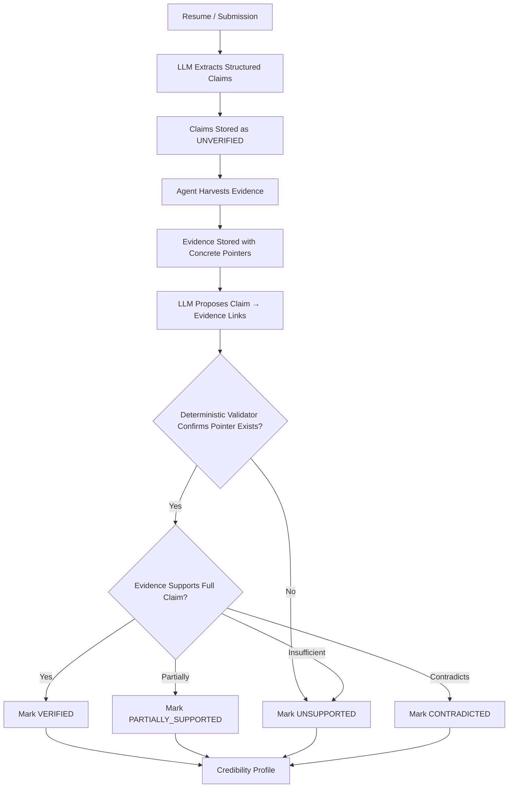

Supported claim statuses:

```text
UNVERIFIED
VERIFIED
PARTIALLY_SUPPORTED
UNSUPPORTED
CONTRADICTED
```

---

## 9. Sandbox Architecture

The sandbox is responsible for executing untrusted candidate code safely. It uses a two-phase model to separate dependency preparation from proof execution.

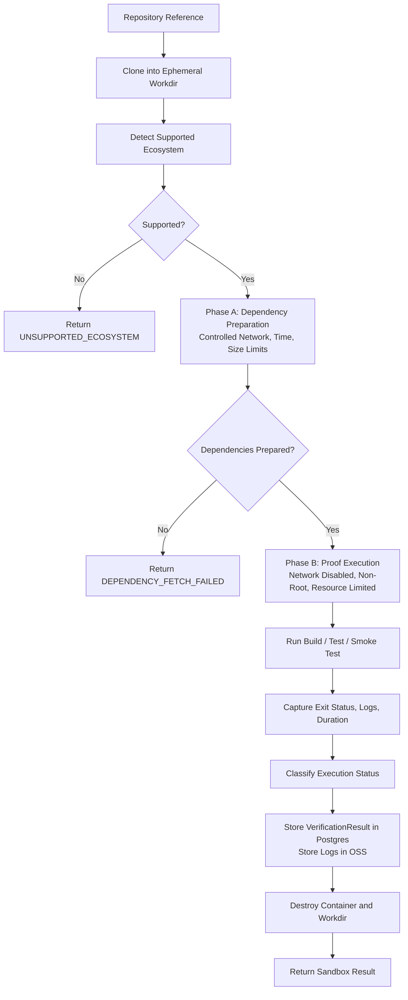

### 9.1 Phase A — Dependency Preparation

Dependency preparation may use controlled network access only for dependency fetching.

Required constraints:

- Strict timeout.
- Strict maximum download size.
- Registry allowlisting where feasible.
- No access to backend secrets.
- No candidate code execution beyond dependency preparation commands required for the supported ecosystem.
- Output is a prepared dependency cache, lockfile snapshot, or build environment.

### 9.2 Phase B — Proof Execution

Proof execution runs candidate code with maximum isolation.

Required constraints:

- Network disabled.
- Non-root user.
- Read-only root filesystem where feasible.
- Ephemeral writable work directory or tmpfs.
- CPU limit.
- Memory limit.
- PID limit.
- Disk limit.
- Wall-clock timeout.
- Single-use container.
- Container destroyed after execution.

### 9.3 Sandbox Statuses

```text
EXECUTION_PASSED
EXECUTION_FAILED
UNSUPPORTED_ECOSYSTEM
DEPENDENCY_FETCH_FAILED
TIMEOUT
SECURITY_BLOCKED
NO_TESTS_FOUND
INTERNAL_ERROR
```

Sandbox outcomes are non-disqualifying. They contribute to claim confidence and profile evidence but do not automatically determine the hiring decision.

---

## 10. Data Model

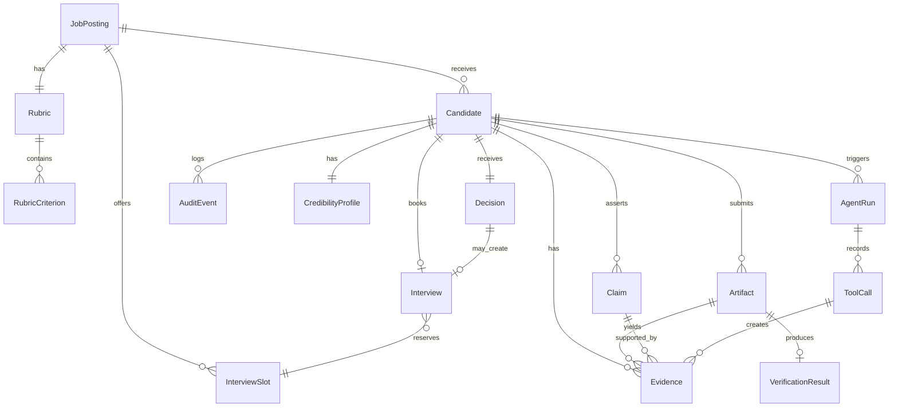

---

## 11. Core Entities

### JobPosting

Represents a role being evaluated.

Key fields:

- `id`
- `title`
- `description`
- `requiredSkills`
- `createdAt`
- `updatedAt`

### Rubric and RubricCriterion

Represents weighted evaluation criteria.

Key fields:

- `id`
- `jobPostingId`
- `criteria`
- `weight`
- `description`

### Candidate

Represents a candidate submission.

Key fields:

- `id`
- `jobPostingId`
- `name`
- `email`
- `resumeText`
- `stage`
- `createdAt`
- `updatedAt`

### Artifact

Represents submitted or harvested artifacts.

Supported artifact types:

```text
RESUME
GITHUB_REPO
LIVE_DEMO
WRITEUP
SANDBOX_LOG
STATIC_ANALYSIS_RESULT
OTHER
```

### Claim

Represents extracted candidate claims.

Supported claim types:

```text
SKILL
PROJECT
ROLE
IMPACT
TECHNOLOGY
CONTRIBUTION
OTHER
```

Supported claim statuses:

```text
UNVERIFIED
VERIFIED
PARTIALLY_SUPPORTED
UNSUPPORTED
CONTRADICTED
```

### Evidence

Represents concrete evidence pointers.

Supported evidence types:

```text
COMMIT_SHA
FILE_PATH
PULL_REQUEST_URL
REPOSITORY_URL
TEST_RUN_ID
SANDBOX_LOG
DEMO_URL
WRITEUP_URL
AUTHORSHIP_RESULT
ORIGINALITY_RESULT
STATIC_ANALYSIS_RESULT
```

### VerificationResult

Stores forensic verification output for an artifact.

Includes:

- Authorship summary.
- Originality summary.
- Sandbox execution summary.
- Static-analysis summary.
- Verification status.

### CredibilityProfile

Stores the assembled evidence-linked candidate profile.

Includes:

- Verified claims.
- Partially supported claims.
- Unsupported claims.
- Contradicted claims.
- Authorship summary.
- Originality summary.
- Sandbox results.
- Confidence levels.
- Evidence links.

### Decision

Stores the agent recommendation.

Supported outcomes:

```text
INTERVIEW
BORDERLINE
NO
NEEDS_HUMAN_REVIEW
```

### AgentRun

Stores one verification workflow execution.

Supported states:

```text
QUEUED
RUNNING
WAITING_FOR_TOOL
COMPLETED
FAILED_RETRYABLE
FAILED_TERMINAL
CANCELLED
```

### ToolCall

Stores every tool invocation.

Includes:

- Tool name.
- Input.
- Output.
- Status.
- Evidence IDs.
- Model used.
- Error.
- Start and completion timestamps.

### AuditEvent

Stores append-only automated and human actions.

Includes:

- Actor.
- Action.
- Before state.
- After state.
- Reason.
- Timestamp.

---

## 12. Tool Contract

Each tool uses a typed request and response with a common result envelope.

```json
{
  "toolCallId": "uuid",
  "toolName": "github.fetchRepository",
  "status": "SUCCESS",
  "input": {},
  "output": {},
  "evidenceIds": [],
  "startedAt": "timestamp",
  "endedAt": "timestamp",
  "error": null
}
```

Supported tool statuses:

```text
SUCCESS
FAILED_RETRYABLE
FAILED_TERMINAL
SKIPPED
TIMEOUT
```

Tool implementation requirements:

- Typed input.
- Typed output.
- Explicit timeout.
- Explicit retry policy.
- Structured error.
- Persisted `ToolCall`.
- Evidence IDs returned where evidence is created.
- Safe stubbing for parallel development.

---

## 13. API Surface

### 13.1 REST Resources

```text
POST   /jobs
GET    /jobs
GET    /jobs/{jobId}
PUT    /jobs/{jobId}

PUT    /jobs/{jobId}/rubric
GET    /jobs/{jobId}/rubric

POST   /jobs/{jobId}/slots
GET    /jobs/{jobId}/slots
PUT    /jobs/{jobId}/slots/{slotId}
DELETE /jobs/{jobId}/slots/{slotId}

POST   /jobs/{jobId}/candidates
GET    /jobs/{jobId}/candidates

GET    /candidates/{candidateId}
GET    /candidates/{candidateId}/artifacts
POST   /candidates/{candidateId}/agent-runs
GET    /candidates/{candidateId}/agent-runs
GET    /candidates/{candidateId}/profile
GET    /candidates/{candidateId}/decision
POST   /candidates/{candidateId}/override
GET    /candidates/{candidateId}/audit-events

GET    /scheduling/{magicToken}
POST   /scheduling/{magicToken}/book
```

### 13.2 Trace Endpoints

Preferred SSE endpoint:

```text
GET /agent-runs/{agentRunId}/events
```

Polling fallback:

```text
GET /agent-runs/{agentRunId}
GET /agent-runs/{agentRunId}/tool-calls
```

---

## 14. End-to-End Technical Flow

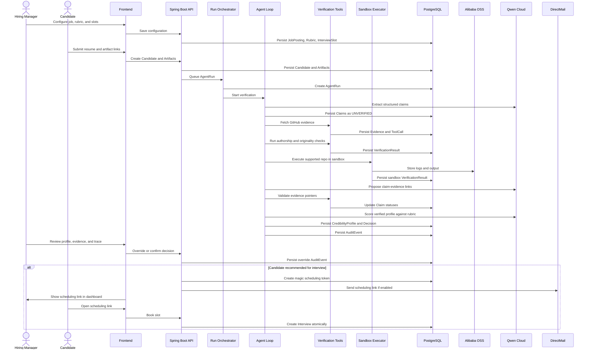

---

## 15. Concurrency Model

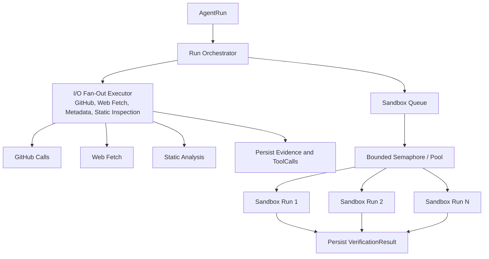

Concurrency requirements:

- I/O-bound verification tasks may fan out concurrently.
- Sandbox tasks must use a separate bounded pool or semaphore.
- Sandbox concurrency must be lower than general I/O concurrency.
- Tool calls must be idempotent where possible.
- Retryable failures must not duplicate evidence or decisions.
- Run state must be persisted before and after major steps.

---

## 16. Deployment Architecture

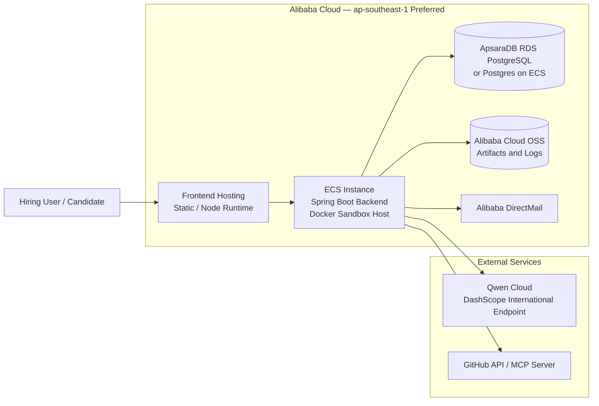

### 16.1 Deployment Notes

- Backend must run on Alibaba Cloud for submission.
- ECS is the simplest deployment target because the sandbox requires Docker/container privileges.
- RDS PostgreSQL is preferred if setup time allows.
- Postgres on ECS is acceptable for a hackathon demo if documented clearly.
- OSS stores sandbox logs and larger artifacts.
- DirectMail is optional for the demo if dashboard-visible scheduling links are implemented.
- Environment variables are used for secrets and API keys.

---

## 17. Security Architecture

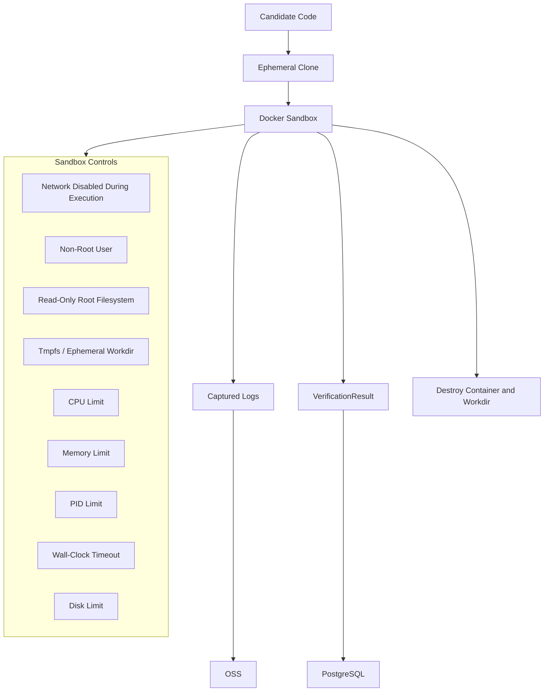

Security requirements:

- Candidate code never executes inside the backend process.
- Sandbox containers are single-use.
- Secrets are not mounted into sandbox containers.
- Sandbox logs are scrubbed or reviewed to avoid secret exposure.
- API keys are environment-injected and never committed.
- GitHub tokens use minimum required scope.
- Magic links are signed and time-limited.
- Slot booking is atomic.
- Overrides and automated actions are audit-logged.

---

## 18. Observability and Audit

The trace and audit system is built into the persistence model.

Stored observability data:

- Agent run status.
- Model used per agent step.
- Tool name, input, output, status, duration, and error.
- Evidence IDs produced by tools.
- Claim status transitions.
- Sandbox execution logs and status.
- Decision rationale.
- Human overrides.
- Scheduling actions.

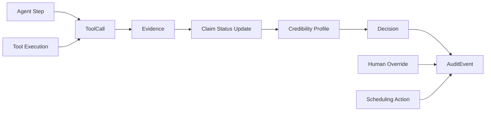

---

## 19. Development Workstream Boundary

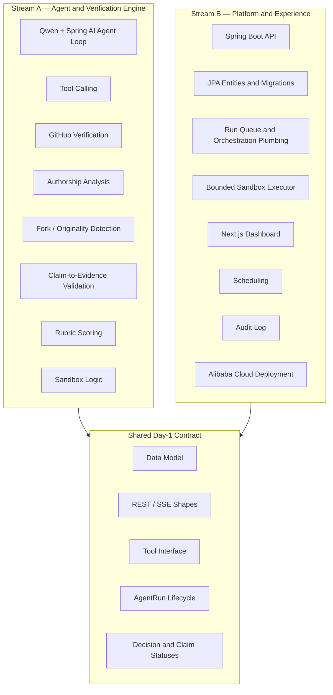

Development boundary:

- Stream A owns agent behavior and verification correctness.
- Stream B owns platform reliability, persistence, UI, scheduling, and deployment.
- The shared contract must be frozen early.
- After contract freeze, schema changes should be additive unless both streams agree.

---

## 20. Demo Architecture Path

The demo should exercise the following vertical slice:

```mermaid
flowchart LR
    JOB["Create Job + Rubric"] --> CAND["Submit Candidate"]
    CAND --> CLAIMS["Extract Claims"]
    CLAIMS --> GH["Harvest GitHub Evidence"]
    GH --> AUTH["Authorship Analysis"]
    AUTH --> ORIG["Fork / Originality Detection"]
    ORIG --> SBX["Sandbox Proof-of-Execution"]
    SBX --> VERIFY["Claim Verification"]
    VERIFY --> PROFILE["Credibility Profile"]
    PROFILE --> DECISION["Rubric Decision"]
    DECISION --> OVERRIDE["Human Review / Override"]
    OVERRIDE --> SCHED["Magic-Link Scheduling"]
    SCHED --> AUDIT["Audit Log"]
```

Required demo fixtures:

- Known-good candidate.
- Known-fake or weak candidate.
- Supported-ecosystem repository.
- Failing or unsupported repository.
- Job rubric.
- Interview slots.
- Cached fallback run.

---

## 21. Failure Handling

### 21.1 Tool Failure Classes

```text
SUCCESS
FAILED_RETRYABLE
FAILED_TERMINAL
SKIPPED
TIMEOUT
```

### 21.2 Run Failure Classes

```text
FAILED_RETRYABLE
FAILED_TERMINAL
CANCELLED
```

### 21.3 Sandbox Failure Classes

```text
UNSUPPORTED_ECOSYSTEM
DEPENDENCY_FETCH_FAILED
EXECUTION_FAILED
TIMEOUT
SECURITY_BLOCKED
NO_TESTS_FOUND
INTERNAL_ERROR
```

Failure-handling requirements:

- Retry transient external-service failures with backoff.
- Persist failure details in `ToolCall`.
- Do not mark claims verified if evidence validation fails.
- Do not reject candidates solely because sandbox execution failed.
- Surface missing, weak, or failed evidence in the credibility profile.
- Continue partial verification when non-critical tools fail.

---

## 22. Scope Control

The architecture is optimized for a narrow hackathon implementation.

Must-have components:

- Qwen-powered tool-calling agent.
- GitHub evidence harvesting.
- Authorship analysis.
- Fork/originality detection.
- Sandbox proof-of-execution for one ecosystem.
- Claim-to-evidence validation.
- Evidence-linked credibility profile.
- Rubric-based decision.
- Human override.
- Audit log.
- Scheduling link flow.
- Alibaba Cloud deployment proof.

Cuttable components:

- AI-generated-code detection.
- Full calendar invite generation.
- Public candidate-facing profile.
- Email deliverability.
- Live SSE trace if polling is sufficient.
- pgvector if deterministic matching is sufficient.
- Multi-candidate batch processing.
- Full resume PDF parsing.
- Multi-ecosystem sandbox support.

---

## 23. Repository Documentation Requirements

The repository should include:

```text
README.md
prd.md
architecture.md
LICENSE
docs/
  deployment.md
  demo-script.md
  fixtures.md
infra/
  docker-compose.yml
  Dockerfile
  deployment-notes.md
```

The README should identify:

- Project name.
- Hackathon track.
- Problem statement.
- Core differentiator.
- Qwen Cloud usage.
- Alibaba Cloud deployment.
- Setup instructions.
- Demo instructions.
- Architecture diagram.
- Submission video link when available.

---

## 24. Architecture Summary

Receipts is a human-controlled verification agent for hiring. Its architecture combines a Qwen-powered agent loop, deterministic evidence validation, GitHub forensic analysis, sandbox proof-of-execution, a persistent trace/audit model, and a dashboard-first hiring workflow.

The system is intentionally centered on the evidence invariant:

> LLMs may propose, summarize, and reason. Deterministic tools verify. Human users review and control final outcomes.
