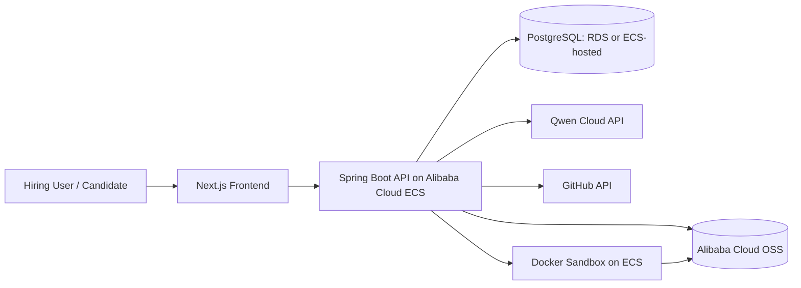

# Deployment Plan

Receipts must show that the backend and required services run on Alibaba Cloud for submission. The deployment plan favors the smallest credible production-like setup that can run the sandbox safely.

## Target Architecture



## Services

| Service | MVP Choice | Notes |
|---|---|---|
| Backend API | Spring Boot on Alibaba Cloud ECS | Required deployment proof target. |
| Frontend | Next.js static or Node runtime | Can be hosted on ECS for simplicity. |
| Database | ApsaraDB RDS PostgreSQL preferred; Postgres on ECS acceptable for demo | Use RDS if setup time allows. |
| Object storage | Alibaba Cloud OSS | Stores resumes, sandbox logs, fixture snapshots, and generated artifacts. |
| Sandbox | Docker on ECS | Requires tight container controls; do not mount secrets or Docker socket into candidate containers. |
| Email | Alibaba DirectMail | Optional; dashboard-visible scheduling link is sufficient for demo. |

## Required Environment

```text
QWEN_BASE_URL
QWEN_API_KEY
QWEN_PLANNER_MODEL
QWEN_EXTRACTOR_MODEL
DATABASE_URL
OSS_ENDPOINT
OSS_BUCKET
OSS_ACCESS_KEY_ID
OSS_ACCESS_KEY_SECRET
GITHUB_TOKEN
APP_BASE_URL
SCHEDULING_SIGNING_SECRET
```

## Deployment Proof

Capture these artifacts before submission:

- Public API or frontend URL.
- Health endpoint response.
- Screenshot or screen recording showing the backend running on Alibaba Cloud.
- OSS bucket evidence for sandbox logs or cached run artifacts.
- Database connection proof with no secrets visible.
- Demo segment showing the deployed app, not only local development.

## Sandbox Guardrails

- Candidate containers run as non-root.
- Containers are not privileged.
- Docker socket is never mounted into candidate containers.
- Backend secrets and cloud credentials are not present in sandbox environment variables.
- Network is disabled during proof execution.
- CPU, memory, PID, disk, and wall-clock limits are enforced.
- Unnecessary Linux capabilities are dropped.
- Logs are scrubbed before display or public sharing.

